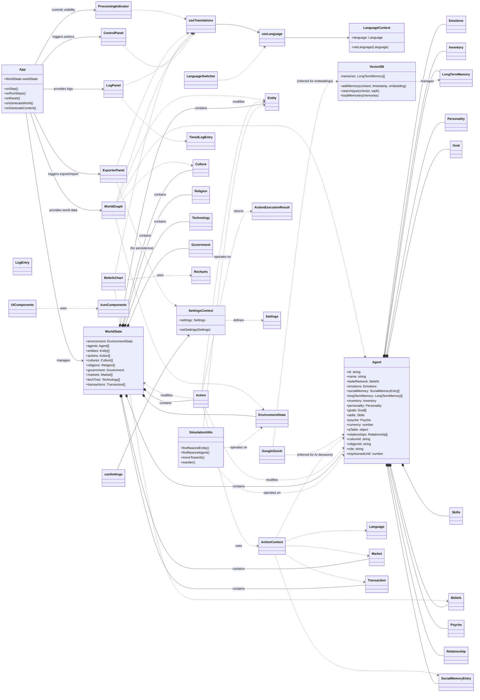

```mermaid
classDiagram
    direction LR

    subgraph Application
        class App {
            +WorldState worldState
            +onStep()
            +onRunSteps()
            +onReset()
            +onGenerateWorld()
            +onGenerateContent()
        }
    end

    subgraph UI Components
        class ControlPanel
        class LogPanel
        class WorldGraph
        class BeliefsChart
        class ExporterPanel
        class LanguageSwitcher
        class ProcessingIndicator
        class IconComponents
    end

    subgraph Contexts
        class LanguageContext {
            +language: Language
            +setLanguage(Language)
        }
        class SettingsContext {
            +settings: Settings
            +setSettings(Settings)
        }
    end

    subgraph Hooks
        class useLanguage
        class useSettings
        class useTranslations
    end

    subgraph Services
        class SimulationUtils {
            +findNearestEntity()
            +findNearestAgent()
            +moveTowards()
            +wander()
        }
        class VectorDB {
            -memories: LongTermMemory[]
            +addMemory(content, timestamp, embedding)
            +search(queryVector, topK)
            +loadMemories(memories)
        }
    end

    subgraph Data Models
        class WorldState {
            +environment: EnvironmentState
            +agents: Agent[]
            +entities: Entity[]
            +actions: Action[]
            +cultures: Culture[]
            +religions: Religion[]
            +government: Government
            +markets: Market[]
            +techTree: Technology[]
            +transactions: Transaction[]
        }
        class Agent {
            +id: string
            +name: string
            +beliefNetwork: Beliefs
            +emotions: Emotions
            +socialMemory: SocialMemoryEntry[]
            +longTermMemory: LongTermMemory[]
            +inventory: Inventory
            +personality: Personality
            +goals: Goal[]
            +skills: Skills
            +psyche: Psyche
            +currency: number
            +qTable: object
            +relationships: Relationship[]
            +cultureId: string
            +religionId: string
            +role: string
            +imprisonedUntil: number
        }
        class Entity
        class Action
        class ActionContext
        class ActionExecutionResult
        class LogEntry
        class TimedLogEntry
        class Settings
        class Language
        class EnvironmentState
        class Culture
        class Religion
        class Market
        class Technology
        class Government
        class Transaction
        class LongTermMemory
        class Beliefs
        class Emotions
        class Inventory
        class Personality
        class Goal
        class Skills
        class Psyche
        class Relationship
        class SocialMemoryEntry
    end

    subgraph External Libraries
        class Recharts
        class GoogleGenAI
    end

    App --> WorldState : manages
    App --> ControlPanel : triggers actions
    App --> LogPanel : provides logs
    App --> WorldGraph : provides world data
    App --> ExporterPanel : triggers export/import
    App --> ProcessingIndicator : controls visibility

    ControlPanel ..> useTranslations
    LogPanel ..> useTranslations
    WorldGraph ..> useTranslations
    BeliefsChart ..> useTranslations
    ExporterPanel ..> useTranslations
    LanguageSwitcher ..> useLanguage
    ProcessingIndicator ..> useTranslations

    useTranslations --> useLanguage
    useSettings --> SettingsContext
    useLanguage --> LanguageContext

    SimulationUtils ..> Agent : operates on
    SimulationUtils ..> Entity : operates on
    SimulationUtils ..> EnvironmentState : operates on

    VectorDB ..> LongTermMemory : manages

    Agent *-- Beliefs
    Agent *-- Emotions
    Agent *-- Inventory
    Agent *-- Personality
    Agent *-- Goal
    Agent *-- Skills
    Agent *-- Psyche
    Agent *-- LongTermMemory
    Agent *-- SocialMemoryEntry
    Agent *-- Relationship

    WorldState *-- EnvironmentState
    WorldState *-- Agent : contains
    WorldState *-- Entity : contains
    WorldState *-- Action : contains
    WorldState *-- Culture : contains
    WorldState *-- Religion : contains
    WorldState *-- Government
    WorldState *-- Market : contains
    WorldState *-- Technology : contains
    WorldState *-- Transaction : contains

    Action ..> Agent : modifies
    Action ..> Entity : modifies
    Action ..> WorldState : modifies
    Action ..> ActionContext : uses
    Action ..> ActionExecutionResult : returns

    ActionContext ..> Language
    ActionContext ..> Market
    ActionContext ..> Agent
    ActionContext ..> Transaction
    ActionContext ..> SocialMemoryEntry

    BeliefsChart ..> Recharts : uses
    SettingsContext ..> Settings : defines

    GoogleGenAI ..> VectorDB : (inferred for embeddings)
    GoogleGenAI ..> Agent : (inferred for AI decisions)

    UI Components ..> IconComponents : uses
    LogPanel ..> TimedLogEntry
    BeliefsChart ..> Beliefs
    WorldGraph ..> Agent
    WorldGraph ..> Entity
    WorldGraph ..> EnvironmentState
    WorldGraph ..> Culture

    ExporterPanel ..> SettingsContext : (for persistence)
```