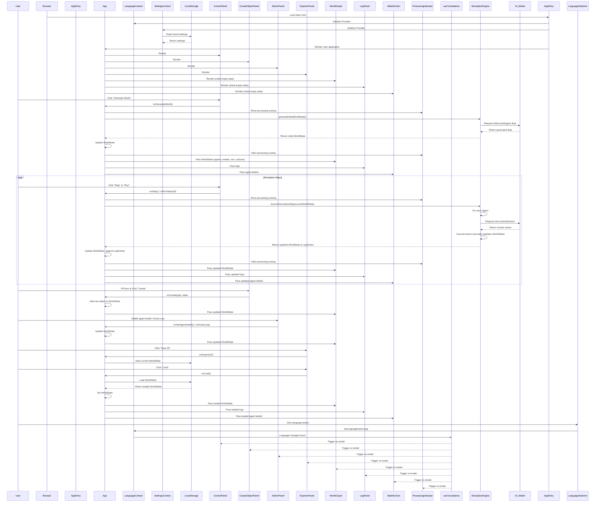

```mermaid
sequenceDiagram
    participant User
    participant Browser
    participant index.tsx as AppEntry
    participant App
    participant LanguageContext
    participant SettingsContext
    participant LocalStorage
    participant ControlPanel
    participant CreateObjectPanel
    participant AdminPanel
    participant ExporterPanel
    participant WorldGraph
    participant LogPanel
    participant BeliefsChart
    participant ProcessingIndicator
    participant useTranslations
    participant SimulationEngine
    participant AI_Model

    Browser->>AppEntry: Load index.html
    AppEntry->>LanguageContext: Initialize Provider
    AppEntry->>SettingsContext: Initialize Provider
    SettingsContext->>LocalStorage: Read stored settings
    LocalStorage-->>SettingsContext: Return settings
    AppEntry->>App: Render main application
    App->>ControlPanel: Render
    App->>CreateObjectPanel: Render
    App->>AdminPanel: Render
    App->>ExporterPanel: Render
    App->>WorldGraph: Render (initial empty state)
    App->>LogPanel: Render (initial empty state)
    App->>BeliefsChart: Render (initial empty state)

    User->>ControlPanel: Click "Generate World"
    ControlPanel->>App: onGenerateWorld()
    App->>ProcessingIndicator: Show processing overlay
    App->>SimulationEngine: generateInitialWorldState()
    SimulationEngine->>AI_Model: Request initial world/agent data
    AI_Model-->>SimulationEngine: Return generated data
    SimulationEngine-->>App: Return initial WorldState
    App->>App: Update WorldState
    App->>ProcessingIndicator: Hide processing overlay
    App->>WorldGraph: Pass WorldState (agents, entities, env, cultures)
    App->>LogPanel: Pass logs
    App->>BeliefsChart: Pass agent beliefs

    loop Simulation Steps
        User->>ControlPanel: Click "Step" or "Run"
        ControlPanel->>App: onStep() / onRunSteps(N)
        App->>ProcessingIndicator: Show processing overlay
        App->>SimulationEngine: executeSimulationStep(currentWorldState)
        SimulationEngine->>SimulationEngine: For each Agent:
        SimulationEngine->>AI_Model: Request next action/decision
        AI_Model-->>SimulationEngine: Return chosen action
        SimulationEngine->>SimulationEngine: Execute Action.execute() (updates WorldState)
        SimulationEngine-->>App: Return updated WorldState & LogEntries
        App->>App: Update WorldState, append LogEntries
        App->>ProcessingIndicator: Hide processing overlay
        App->>WorldGraph: Pass updated WorldState
        App->>LogPanel: Pass updated logs
        App->>BeliefsChart: Pass updated agent beliefs
    end

    User->>CreateObjectPanel: Fill form & Click "Create"
    CreateObjectPanel->>App: onCreate(type, data)
    App->>App: Add new object to WorldState
    App->>WorldGraph: Pass updated WorldState

    User->>AdminPanel: Modify agent health / Enact Law
    AdminPanel->>App: onSetAgentHealth() / onEnactLaw()
    App->>App: Update WorldState
    App->>WorldGraph: Pass updated WorldState

    User->>ExporterPanel: Click "Save All"
    ExporterPanel->>App: onExport('all')
    App->>LocalStorage: Save current WorldState

    User->>ExporterPanel: Click "Load"
    ExporterPanel->>App: onLoad()
    App->>LocalStorage: Load WorldState
    LocalStorage-->>App: Return loaded WorldState
    App->>App: Set WorldState
    App->>WorldGraph: Pass loaded WorldState
    App->>LogPanel: Pass loaded logs
    App->>BeliefsChart: Pass loaded agent beliefs

    User->>LanguageSwitcher: Click language button
    LanguageSwitcher->>LanguageContext: setLanguage(newLang)
    LanguageContext->>useTranslations: Language changed event
    useTranslations-->>ControlPanel: Trigger re-render
    useTranslations-->>CreateObjectPanel: Trigger re-render
    useTranslations-->>AdminPanel: Trigger re-render
    useTranslations-->>ExporterPanel: Trigger re-render
    useTranslations-->>WorldGraph: Trigger re-render
    useTranslations-->>LogPanel: Trigger re-render
    useTranslations-->>BeliefsChart: Trigger re-render
    useTranslations-->>ProcessingIndicator: Trigger re-render
```