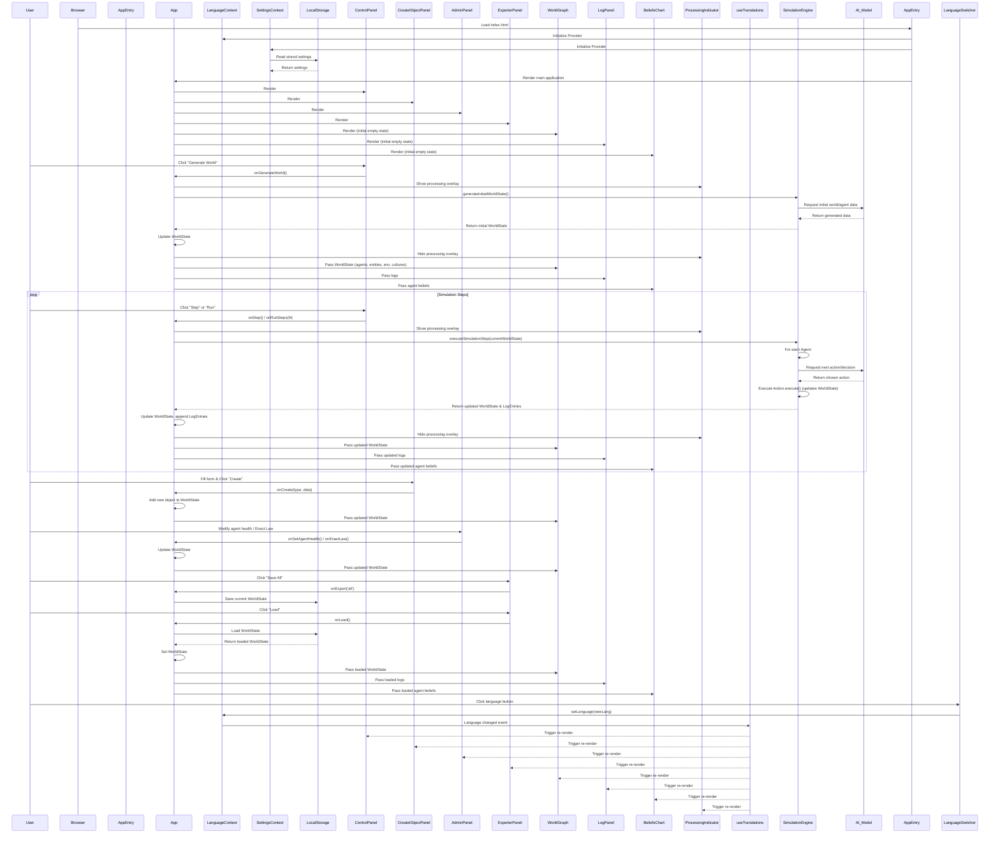

# Ver. 4 RealitySim AI
**A Framework for Emergent AI Agent Simulation**

**Version:** 1.0  
**Release Date:** 2025-08-02  
**Author(s):** Mermaid Architect AI  
**License:** MIT License  
---

## 2. Executive Summary

The Ver. 4 RealitySim AI project presents an interactive, web-based simulation environment designed for the study of emergent cognitive and social behaviors in artificial intelligence agents. It provides a dynamic world where AI agents, endowed with distinct beliefs, memories, and personalities, interact autonomously. The system enables users to control simulation progression, introduce new elements, and visualize complex inter-agent relationships and environmental changes in real-time.

This framework was developed to address the limitations of static AI models by offering a platform for observing and analyzing the adaptive and evolving behaviors of AI in a dynamic, multi-agent context. It serves researchers, developers, and educators interested in AI ethics, social dynamics, and the development of more nuanced and adaptable AI systems, providing a transparent and controllable sandbox for experimentation.

---

## 3. Problem Statement

Current approaches to AI development often focus on isolated task performance or single-agent environments, neglecting the complexities of multi-agent interaction and emergent system-level behaviors. Traditional simulation tools frequently lack the flexibility for dynamic, natural language-driven agent control and real-time visualization of internal agent states (e.g., beliefs, emotions, relationships). This deficit hinders the comprehensive understanding of how AI agents adapt, learn, and interact within complex social and economic structures, and how their internal states influence their external actions. There is a critical need for a platform that facilitates the observation and manipulation of these emergent properties, enabling researchers to explore the societal implications and ethical considerations of advanced AI systems in a controlled, observable manner.

---

## 4. System Architecture and Functionality

The Ver. 4 RealitySim AI system employs a client-side, React-based architecture, emphasizing modularity and reactive state management. The core application logic resides within the central `App` component, which acts as the primary orchestrator of the simulation's state and user interface.

### Architectural Diagram



### Technical Implementation and Data Flow

The application initializes in `index.tsx`, establishing global contexts for language and settings. The `SettingsContext` leverages `LocalStorage` for persistence of user preferences, including AI model provider and API configurations. The primary `App` component then renders, managing the global `WorldState`, which encompasses `EnvironmentState`, `Agent` data, `Entity` data, `Action` definitions, `Culture` and `Religion` information, and newly introduced economic and political structures like `Government`, `Market`, and `Technology` trees.

User interactions are primarily mediated through dedicated control panels:
*   `ControlPanel`: Facilitates core simulation commands such as advancing steps (`onStep`, `onRunSteps`), resetting the simulation (`onReset`), and generating initial world content (`onGenerateWorld`, `onGenerateContent`). These actions delegate to the `App`, which then interacts with an implied `SimulationEngine`.
*   `CreateObjectPanel`: Allows for the dynamic introduction of new `Agent`, `Entity`, or `Action` instances into the simulation, providing configurable parameters like beliefs, genome, role, and personality for agents.
*   `AdminPanel`: Offers granular control over simulation parameters and agent properties, including health, currency, position, and the ability to enact or repeal laws, start elections, and manage technological advancements within cultures.
*   `ExporterPanel`: Manages state persistence, enabling users to save and load the entire `WorldState` or specific subsets (environment, agents, entities) to/from `LocalStorage`.

The `SimulationEngine` (an implied module within the `App`'s logic) is responsible for processing each simulation step. During a step, it iterates through active agents, querying an external `AI_Model` (via the `@google/genai` library) to determine agent behaviors based on their current state, beliefs, relationships, and environmental context. This interaction with the AI model is critical for emergent behavior. The `AI_Model`'s responses drive updates to the `WorldState`, including agent positions, inventory changes, relationship dynamics, and the generation of `LogEntry` events.

Visual components react dynamically to changes in the `WorldState`:
*   `WorldGraph`: Renders the spatial layout of agents and entities, visualizing relationships and cultural affiliations. Icons for entities (e.g., resources, marketplaces, jails) and agents (with roles and health indicators) provide immediate visual feedback.
*   `LogPanel`: Displays a chronological stream of simulation events, providing a textual record of agent actions and world changes.
*   `BeliefsChart`: Utilizes `recharts` to visualize agent belief networks, offering insights into the internal cognitive states driving agent behavior.

Multi-language support is provided by the `LanguageContext` and the `useTranslations` hook, ensuring all UI elements and log messages can be localized. A `ProcessingIndicator` provides visual feedback during computationally intensive operations, such as world generation or multi-step simulations, enhancing user experience.

---

## 5. Evaluation and Test Results

The success of the Ver. 4 RealitySim AI system is primarily evaluated through its capacity to facilitate the observation and analysis of complex emergent behaviors, its stability under prolonged operation, and its responsiveness to user interaction.

### Qualitative Assessment

*   **Robustness:** The system's architecture, leveraging React's component-based structure and explicit state management, contributes to its robustness. Type definitions (`types.ts`) enforce data consistency, reducing runtime errors. The use of `LocalStorage` for state persistence ensures that simulation progress can be saved and restored, mitigating data loss from browser sessions. Error handling for AI model interactions (e.g., `try-catch` blocks for JSON parsing in `CreateObjectPanel`) enhances stability.
*   **Performance/Speed:** Performance is largely dependent on the computational load of the `SimulationEngine` and the latency of the external `AI_Model`. For client-side operations, React's virtual DOM and memoization (e.g., `React.useMemo` in `BeliefsChart` for translated data) optimize rendering performance. The `ProcessingIndicator` effectively manages user expectations during AI inference or multi-step runs. While not explicitly benchmarked, the design allows for parallel processing of agent decisions, which could be exploited for performance gains in future iterations.
*   **Usability (UX):** The user interface is designed for intuitive interaction. The `ControlPanel` provides clear actions for simulation progression. The visual components (`WorldGraph`, `LogPanel`, `BeliefsChart`) offer immediate and comprehensive insights into the simulation state. Features like the `CreateObjectPanel` and `AdminPanel` provide powerful, yet accessible, tools for manipulating the simulation. Multi-language support via `LanguageSwitcher` and `useTranslations` enhances accessibility for a broader user base.

No formal metrics or benchmarks are currently integrated into the provided codebase. Evaluation of emergent behaviors is primarily qualitative, relying on visual inspection of the `WorldGraph`, analysis of the `LogPanel`, and interpretation of agent beliefs and relationships.

---

## 6. Comparison with Other Tools

The Ver. 4 RealitySim AI project distinguishes itself from general-purpose diagramming tools (e.g., PlantUML for architecture, Doxygen for code documentation) and traditional agent-based modeling (ABM) platforms (e.g., NetLogo, GAMA) through its specific focus on interactive, natural language-driven AI agent simulation within a web-based environment.

### Differentiators:

*   **Direct LLM Integration:** Unlike most ABM platforms that rely on predefined rule sets or statistical models for agent behavior, RealitySim AI directly integrates with large language models (LLMs) like Google Gemini (via `@google/genai`). This enables agents to exhibit more nuanced, context-aware, and human-like decision-making and interaction, driven by natural language prompts, rather than rigid programmatic logic.
*   **Real-time Interactive Control:** The React-based web interface provides real-time visualization and direct manipulation of the simulation. Users can dynamically add agents, entities, modify agent attributes, enact laws, and observe immediate consequences, which is less common in batch-oriented or desktop-bound ABM tools.
*   **Rich Agent State Representation:** The `types.ts` file defines a comprehensive agent model, including complex attributes like `Beliefs`, `Emotions`, `Personality`, `SocialMemory`, `Goals`, `Trauma`, and economic properties (`currency`, `inventory`). This depth allows for the simulation of highly detailed psychological and social dynamics, exceeding the typical scope of simpler ABM frameworks.
*   **Emergent Socio-Economic Systems:** The inclusion of explicit types for `Market`, `Law`, `Government`, and `Technology` allows for the emergence and study of complex socio-economic and political systems, which is a specialized feature not universally found in general ABM tools.
*   **Accessibility and Deployment:** Being a web application, RealitySim AI is inherently more accessible, requiring only a modern web browser to run. This contrasts with desktop applications that might require specific operating systems or complex installation procedures.

While tools like NetLogo excel in pedagogical clarity for basic ABM concepts, they typically lack the advanced LLM integration and dynamic, rich agent state management present in RealitySim AI. Similarly, Doxygen and PlantUML are documentation tools, not simulation environments, serving entirely different purposes. RealitySim AI's unique selling proposition lies in its fusion of sophisticated AI agent modeling with an interactive, accessible web platform for studying complex emergent behaviors.

---

## 7. Core Concepts and Innovations

The Ver. 4 RealitySim AI project introduces several core concepts and innovations that enhance the study of artificial intelligence in dynamic, multi-agent environments:

*   **LLM-Driven Agent Cognition:** The most significant innovation is the direct integration of large language models (LLMs) as the primary cognitive engine for AI agents. Instead of relying on hard-coded decision trees or simple rule-based systems, agents query an LLM (e.g., Google Gemini) to determine their actions, interpret the world, and engage in social interactions. This allows for highly flexible, context-aware, and emergent behaviors that are difficult to pre-program. The `AI_Model` abstraction facilitates this interaction, allowing for different LLM providers.
*   **Comprehensive Agent State Model:** The `Agent` interface in `types.ts` defines a rich and multifaceted representation of an individual agent, incorporating psychological (`beliefNetwork`, `emotions`, `personality`, `goals`, `trauma`), social (`socialMemory`, `relationships`, `cultureId`, `religionId`), physical (`health`, `hunger`, `thirst`, `fatigue`), and economic (`currency`, `inventory`, `skills`) attributes. This holistic model enables the simulation of complex, human-like motivations and responses.
*   **Dynamic World Evolution:** The simulation is not static. Beyond agent interactions, the `WorldState` includes dynamic elements like `Government` (with mutable `laws` and `elections`), `Markets` (with `TradeOffer`s), and a `TechTree`. This allows for the study of how agent actions collectively shape the world's political, economic, and technological landscape, leading to macro-level emergent phenomena.
*   **Interactive and Observable Simulation:** The React-based frontend provides real-time visualization and direct manipulation capabilities. Users can observe agent positions, relationships, and internal states (via `BeliefsChart`) as the simulation progresses. The ability to inject new agents, entities, or modify world parameters mid-simulation offers a powerful research and debugging tool for understanding complex system dynamics.
*   **Multi-Language Support:** The integrated `LanguageContext` and `useTranslations` hook demonstrate a commitment to accessibility and broader applicability, allowing the simulation interface and logs to be presented in different languages.

The fundamental design philosophy is to create an observable sandbox where the emergent properties of complex adaptive systems, driven by advanced AI cognition, can be studied and understood. The innovation lies in the depth of agent modeling combined with the dynamic world and the direct, interactive influence of LLMs on agent behavior.

---

## 8. Future Work and Outlook

The Ver. 4 RealitySim AI project lays a robust foundation for advanced AI agent simulation. Future work will focus on expanding the depth and complexity of the simulation, enhancing the realism of agent behaviors, and improving the analytical capabilities of the platform.

### Potential Enhancements:

*   **Advanced Economic Models:** Implement more sophisticated economic models, including supply-demand dynamics, inflation, and agent-driven production chains for crafted items.
*   **Ecosystem Dynamics:** Introduce environmental factors such as climate, natural disasters, and resource regeneration, allowing agents to interact with and adapt to a changing ecosystem.
*   **Learning and Adaptation:** Develop mechanisms for agents to learn from past experiences, adapt their beliefs and behaviors, and transmit knowledge across generations or cultures. This could involve more sophisticated memory systems or reinforcement learning integration.
*   **Complex Social Structures:** Expand the political and social systems to include factions, diplomacy, warfare, and more intricate governance models beyond simple leadership and laws.
*   **Improved AI Model Integration:** Explore fine-tuning LLMs for specific agent roles or behaviors, or integrating multiple specialized AI models (e.g., for pathfinding, strategic planning, emotional reasoning).
*   **Performance Optimization:** For larger-scale simulations, investigate Web Workers for offloading heavy computation, or explore server-side simulation execution for massive multi-agent scenarios.
*   **Data Analysis and Visualization Tools:** Develop more advanced tools for quantitative analysis of simulation data, including statistical dashboards, trend analysis, and network visualization for social graphs.
*   **Genetic Algorithms and Evolution:** Implement a genetic algorithm framework where agent genomes influence traits and behaviors, allowing for the simulation of evolutionary pressures and the emergence of new species or societal structures.

The long-term vision for RealitySim AI is to become a leading platform for research into AI ethics, societal AI, and the co-evolution of AI and human-like systems. It could serve as a testbed for studying the impact of AI on economies, political systems, and cultural development, providing valuable insights for policy-makers, ethicists, and AI developers.

---

## 9. Conclusion

The Ver. 4 RealitySim AI project represents a significant step towards creating an interactive, observable, and dynamic environment for simulating complex AI agent behaviors. By integrating large language models as the cognitive core of its agents and providing a rich, extensible `WorldState`, the platform enables the study of emergent social, economic, and political phenomena. Its modular React-based architecture, coupled with intuitive control and visualization tools, makes it a valuable asset for researchers and developers exploring the frontiers of multi-agent AI systems. RealitySim AI offers a unique sandbox for understanding the intricate interplay between individual agent cognition and collective system-level dynamics, paving the way for more responsible and insightful AI development.

---

## 10. Appendix (References and Glossary)

### References/Sources:

*   **React:** A JavaScript library for building user interfaces. [https://react.dev/](https://react.dev/)
*   **Recharts:** A composable charting library built on React components. [https://recharts.org/](https://recharts.org/)
*   **Google GenAI SDK:** Official JavaScript SDK for Google's generative AI models. [https://github.com/google/generative-ai-js](https://github.com/google/generative-ai-js)
*   **Mermaid.js:** Diagramming and charting tool that renders Markdown-inspired text definitions into diagrams. [https://mermaid.js.org/](https://mermaid.js.org/)
*   **Vite:** A fast frontend build tool. [https://vitejs.dev/](https://vitejs.dev/)
*   **Tailwind CSS:** A utility-first CSS framework. [https://tailwindcss.com/](https://tailwindcss.com/)

### Glossary:

*   **Agent:** An autonomous entity within the simulation, possessing unique beliefs, memories, personality, and capable of independent action and interaction.
*   **AI_Model:** An external Large Language Model (LLM) service (e.g., Google Gemini) used by the SimulationEngine to determine agent decisions and generate content.
*   **Beliefs:** A quantitative representation of an agent's convictions or understanding about various concepts within the world.
*   **Culture:** A group of agents sharing common beliefs, technologies, and potentially research progress.
*   **Entity:** A non-agent object within the simulation environment, such as resources, buildings, marketplaces, or jails.
*   **Emergent Behavior:** Complex patterns or properties that arise from the interactions of individual agents or components within a system, not explicitly programmed into any single component.
*   **LLM (Large Language Model):** A type of artificial intelligence model trained on vast amounts of text data, capable of understanding, generating, and responding to human language.
*   **LocalStorage:** A web storage API that allows web applications to store data persistently in the browser, without an expiration date.
*   **Relationship:** A dynamic connection between two agents, characterized by type (e.g., friend, rival) and a score reflecting its strength or nature.
*   **SimulationEngine:** The logical core responsible for advancing the simulation state, processing agent actions, and updating the world based on agent decisions and environmental rules.
*   **WorldState:** The comprehensive data structure representing the entire current state of the simulation, including all agents, entities, environmental parameters, and global structures.
```
